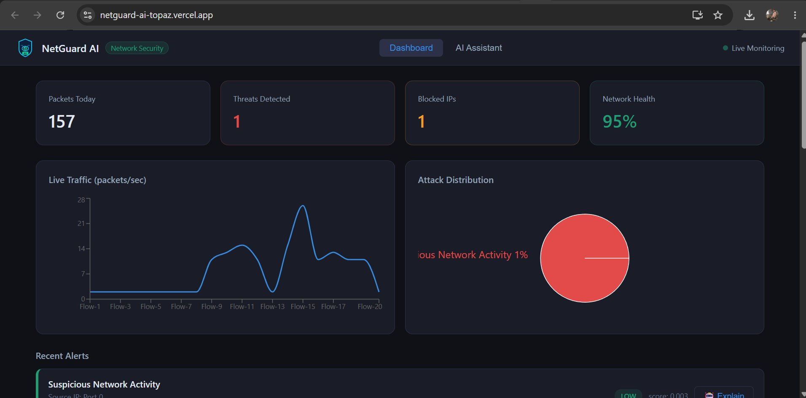
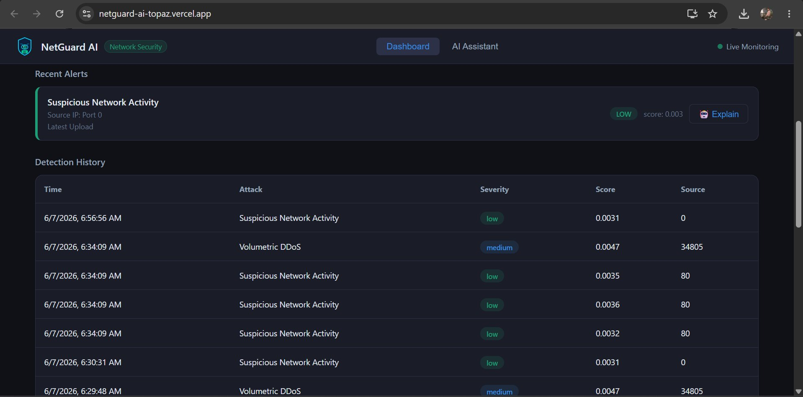
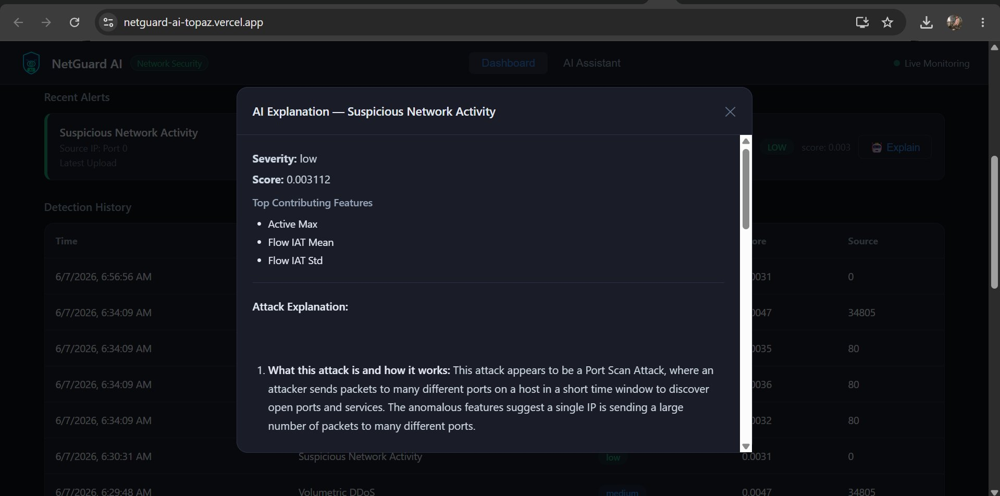
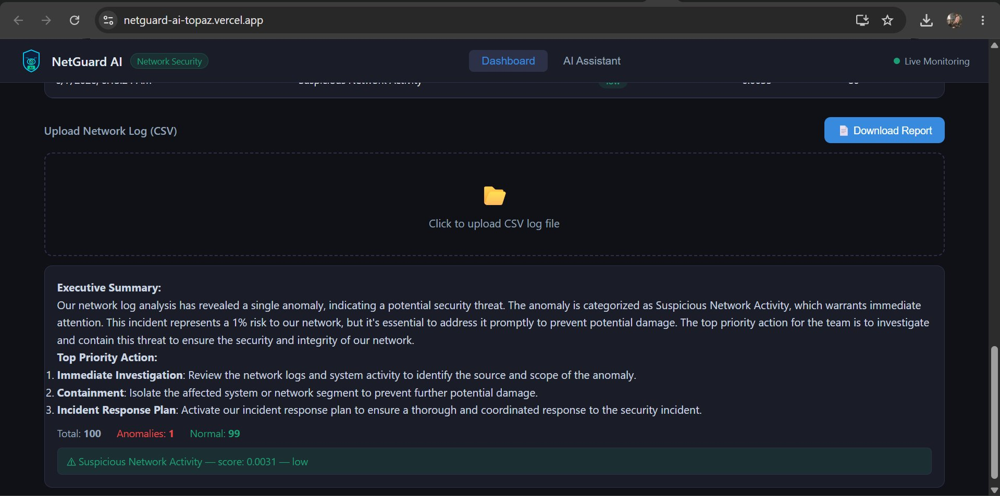
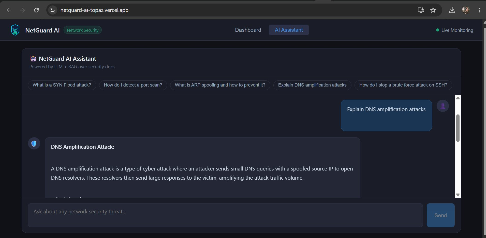

<div align="center">


# 🛡️ NetGuard AI

### AI-Powered Network Threat Detection Platform

**Built end-to-end — from PyTorch model training to full cloud deployment.**

Detects network intrusions using an Autoencoder neural network, classifies attack types, explains every threat in plain English via a Groq LLM + RAG pipeline, and presents everything on a live React dashboard.

[🌐 Live Demo](https://netguard-ai-topaz.vercel.app) • [⚙️ Backend API](https://omhugginggface-netguard-ai-backend.hf.space) • [📖 API Docs](https://omhugginggface-netguard-ai-backend.hf.space/docs)

</div>

---

## 📸 Screenshots

### Main Dashboard — Live Traffic & Threat Overview


> Stat cards, live traffic line chart (packets/sec), attack distribution pie chart, and real-time alert feed — all in one view.

---

### Detection History — Full Alert Log


> Every detected anomaly persisted in SQLite and surfaced in a sortable table with timestamp, attack type, severity badge, anomaly score, and source.

---

### AI Explanation Modal — Powered by Groq LLM + RAG


> One click on **Explain** fires a Groq LLM call with RAG context from ChromaDB. The modal shows severity, anomaly score, top contributing network features, and a structured plain-English breakdown of what happened and how to respond.

---

### CSV Upload & Executive Summary Report


> Upload any CICIDS2017-format network log. The backend runs the Autoencoder, classifies anomalies, and instantly surfaces an executive summary with top priority actions, total packets, and anomaly breakdown — plus a one-click PDF download.

---

### AI Assistant — RAG-Powered Security Chatbot


> A dedicated chatbot tab powered by Groq LLM + ChromaDB RAG over curated security docs. Ask anything — "Explain DNS amplification attacks", "How do I detect a port scan?" — and get expert, grounded answers instantly.

---

## 🌐 Live Deployment

| Layer | URL |
|---|---|
| 🖥️ **Frontend (Vercel)** | https://netguard-ai-topaz.vercel.app |
| ⚙️ **Backend API (Hugging Face Spaces — Docker)** | https://omhugginggface-netguard-ai-backend.hf.space |
| 📖 **Swagger / Interactive API Docs** | https://omhugginggface-netguard-ai-backend.hf.space/docs |

> The backend runs as a **Dockerized FastAPI service on Hugging Face Spaces**. The frontend is deployed on **Vercel**. Both are live and publicly accessible — no setup needed to try it.

---

## 🚨 The Problem It Solves

Traditional network monitoring tools generate hundreds of raw alerts with no context. Admins have to manually decode logs, cross-reference attack databases, and figure out what to do — and in cybersecurity, time is everything.

**NetGuard AI bridges this gap by:**

- **Detecting anomalies** in network traffic using unsupervised ML — no labeled attack data required
- **Classifying attack types** (DDoS, Port Scan, SYN Flood, Brute Force) from raw traffic features
- **Explaining threats in plain English** via a Groq LLM backed by a RAG retrieval pipeline
- **Providing an AI chatbot** for conversational security Q&A, grounded in real security docs
- **Generating downloadable PDF reports** for audits and incident documentation

---

## ✨ Features

| Feature | Description |
|---|---|
| 🔍 **Anomaly Detection** | Autoencoder trained only on normal traffic — flags deviations via reconstruction error |
| 🎯 **Attack Classification** | Rule-based classifier maps anomalies to DDoS, SYN Flood, Port Scan, and more |
| 🤖 **LLM Threat Explainer** | Groq (LLaMA 3.1-8B) explains every alert with top features + remediation steps |
| 📚 **RAG Security Engine** | ChromaDB retrieves curated security docs to ground LLM responses |
| 💬 **AI Assistant Chatbot** | Dedicated chat tab with suggested prompts and expert, grounded answers |
| 📊 **Live Dashboard** | Traffic line chart, attack distribution pie chart, stat cards, alert feed |
| 📄 **PDF Report Generator** | Executive summary + full alert list downloadable with one click |
| 🗄️ **Persistent Alert History** | All detections stored in SQLite and queryable at any time |
| ⚡ **Severity Scoring** | Every anomaly scored Low / Medium / High / Critical based on reconstruction error |
| 🐳 **Dockerized Deployment** | Backend containerized and deployed on Hugging Face Spaces via Docker |

---

## 🏗️ Architecture

```
User uploads network traffic CSV
              │
              ▼
   ┌──────────────────────┐
   │   React Dashboard    │  ←  Vercel (Frontend)
   │  Recharts · Fetch    │
   └──────────┬───────────┘
              │  REST API
              ▼
   ┌──────────────────────┐
   │   FastAPI Backend    │  ←  Hugging Face Spaces (Docker)
   └──────┬───────────────┘
          │
   ┌──────┴──────────────────────────────┐
   │                                     │
   ▼                                     ▼
┌───────────────────┐       ┌────────────────────────┐
│  Autoencoder (ML) │       │   Groq LLM Engine      │
│  PyTorch          │       │   LLaMA 3.1-8B-instant │
└────────┬──────────┘       └──────────┬─────────────┘
         │                             │
         ▼                             ▼
┌───────────────────┐       ┌────────────────────────┐
│  Rule-Based       │       │   ChromaDB RAG Store   │
│  Attack Classifier│       │   (Security Docs)      │
└────────┬──────────┘       └──────────┬─────────────┘
         │                             │
         └──────────────┬──────────────┘
                        │
                        ▼
               ┌─────────────────┐
               │  SQLite Alerts  │
               └────────┬────────┘
                        │
             ┌──────────┴───────────┐
             ▼                      ▼
      Dashboard UI            PDF Report
```

---

## 🧠 ML Pipeline — The Core

### Why an Autoencoder?

Most intrusion detection systems need **labeled attack data** to train — expensive, incomplete, and blind to new attack types.

An **Autoencoder** learns differently:

- Trained **only on normal (BENIGN) traffic** from CICIDS2017
- Learns to **reconstruct normal flows** with minimal error
- **Attacks produce high reconstruction error** → anomaly flagged

This means NetGuard AI can detect **zero-day attacks it has never seen**, with no labeled attack samples needed during training.

### Model Architecture

```
Input          →  78 network features (MinMax scaled to [0, 1])
Encoder        →  Linear(78→64) → ReLU → Linear(64→32) → ReLU → Linear(32→8)
Latent Space   →  8-dimensional compressed representation of normal traffic
Decoder        →  Linear(8→32) → ReLU → Linear(32→64) → ReLU → Linear(64→78)
Output         →  Reconstructed traffic features
Loss           →  MSE between input and reconstruction
```

### Anomaly Scoring

```python
reconstruction_error = MSE(original, reconstructed)

if error < threshold:           → Normal
elif error < threshold * 2:     → Low
elif error < threshold * 4:     → Medium
elif error < threshold * 8:     → High
else:                           → Critical
```

### Top Feature Detection

For each anomaly, NetGuard identifies **which features drove the alert** — e.g. `Active Max`, `Flow IAT Mean`, `Flow IAT Std`, `Flow Bytes/s`, `SYN Flag Count` — giving admins precise forensic context (visible in the AI Explanation modal above).

### Dataset

Trained on **CICIDS2017** (Canadian Institute for Cybersecurity):

- Training data: `BENIGN` samples only
- Attack traffic (evaluation only): DDoS, Port Scan, Botnet, Brute Force, Web Attacks, DoS

---

## 🔬 Attack Classification

After anomaly detection, a rule-based classifier assigns a human-readable label:

| Condition | Detected Attack |
|---|---|
| `Flow Bytes/s > 1,000,000` | Volumetric DDoS |
| `Packet Rate > 5,000` | Packet Flood |
| `SYN Flag Count` elevated | SYN Flood |
| Repeated destination port sweep | Port Scan |
| Other high-error anomaly | Suspicious Network Activity |

---

## 🤖 LLM + RAG — The Explainer Layer

Every alert triggers a **Groq (LLaMA 3.1-8B-instant)** call with two inputs:

1. **Alert context** — attack type, severity, anomaly score, top contributing features
2. **RAG context** — security documents retrieved from **ChromaDB** by vector similarity

The LLM returns a structured explanation covering:

- What the attack is and how it works
- Why this specific traffic triggered the flag
- The potential impact
- Concrete remediation steps

The AI Assistant chatbot uses the same RAG pipeline for open-ended security Q&A, with suggested prompts to guide users.

---

## 🛠️ Tech Stack

### Backend
| Technology | Purpose |
|---|---|
| **FastAPI** | Async REST API with auto Swagger/OpenAPI docs |
| **PyTorch** | Autoencoder neural network — anomaly detection |
| **scikit-learn** | MinMaxScaler for feature normalization |
| **Groq API** | LLM inference — LLaMA 3.1-8B-instant |
| **ChromaDB** | Vector DB for RAG document retrieval |
| **SQLite** | Persistent alert history storage |
| **ReportLab** | Programmatic PDF report generation |
| **Pandas / NumPy** | Data preprocessing and feature extraction |
| **Docker** | Containerized deployment on Hugging Face Spaces |

### Frontend
| Technology | Purpose |
|---|---|
| **React 18** | Dashboard UI and AI Assistant tab |
| **Recharts** | Live traffic line chart + attack distribution pie chart |
| **Fetch API** | REST communication with FastAPI backend |
| **Vercel** | Frontend deployment and global CDN |

---

## 🚀 Setup & Installation

### Prerequisites

- Python 3.10+
- Node.js 18+
- Groq API Key — [get one free](https://console.groq.com)

### Backend Setup

```bash
git clone https://github.com/yourusername/netguard-ai.git
cd netguard-ai/backend

python -m venv venv
source venv/bin/activate        # Windows: venv\Scripts\activate

pip install -r requirements.txt

export GROQ_API_KEY="your_groq_api_key_here"

uvicorn main:app --reload --port 8000
```

### Frontend Setup

```bash
cd ../frontend
npm install
npm start
```

Visit `http://localhost:3000` — the dashboard is live.

### Docker (Production)

```bash
docker build -t netguard-backend ./backend
docker run -p 8000:8000 -e GROQ_API_KEY="your_key" netguard-backend
```

### Train the Model (Optional)

```bash
cd backend/ml
# Place CICIDS2017 CSV files in /data
python train_autoencoder.py
# Outputs: models/autoencoder.pth + models/scaler.pkl
```

---

## 📡 API Reference

| Method | Endpoint | Description |
|---|---|---|
| `GET` | `/` | Health check — returns version |
| `GET` | `/dashboard-stats` | Packets, threat count, blocked IPs, health score |
| `POST` | `/upload-log` | Upload a network traffic CSV |
| `POST` | `/analyze` | Run Autoencoder anomaly detection on uploaded log |
| `POST` | `/chat` | Query the RAG-powered AI Assistant |
| `GET` | `/history` | Retrieve all stored alerts from SQLite |
| `GET` | `/alert/{id}` | Get full details + LLM explanation for one alert |
| `GET` | `/download-report` | Download formatted PDF security report |

Full interactive docs at [`/docs`](https://omhugginggface-netguard-ai-backend.hf.space/docs).

### Example: Upload & Analyze

```bash
curl -X POST https://omhugginggface-netguard-ai-backend.hf.space/upload-log \
  -F "file=@network_traffic.csv"

curl -X POST https://omhugginggface-netguard-ai-backend.hf.space/analyze
```

### Example: AI Assistant

```bash
curl -X POST https://omhugginggface-netguard-ai-backend.hf.space/chat \
  -H "Content-Type: application/json" \
  -d '{"message": "Explain DNS amplification attacks and how to stop them"}'
```

---

## 📁 Project Structure

```
netguard-ai/
├── backend/
│   ├── main.py                  # FastAPI app — all endpoints
│   ├── Dockerfile               # Docker config for Hugging Face Spaces
│   ├── ml/
│   │   ├── autoencoder.py       # PyTorch Autoencoder definition
│   │   ├── train.py             # Training script (CICIDS2017 → weights)
│   │   ├── inference.py         # Anomaly detection + severity scoring
│   │   └── classifier.py        # Rule-based attack classifier
│   ├── rag/
│   │   ├── chroma_store.py      # ChromaDB setup, ingestion, retrieval
│   │   └── security_docs/       # Curated security knowledge base
│   ├── db/
│   │   └── database.py          # SQLite alert storage layer
│   ├── reports/
│   │   └── generator.py         # ReportLab PDF generator
│   ├── models/
│   │   ├── autoencoder.pth      # Trained model weights
│   │   └── scaler.pkl           # Fitted MinMaxScaler
│   └── requirements.txt
├── frontend/
│   ├── src/
│   │   ├── App.jsx              # Root — routing between Dashboard / AI Assistant
│   │   ├── components/
│   │   │   ├── Dashboard.jsx    # Stat cards + charts layout
│   │   │   ├── AlertTable.jsx   # Detection history table
│   │   │   ├── TrafficGraph.jsx # Recharts live traffic line chart
│   │   │   ├── AttackPieChart.jsx # Attack distribution pie chart
│   │   │   └── Chatbot.jsx      # AI Assistant chat interface
│   │   └── index.css
│   └── package.json
├── data/
│   └── sample_traffic.csv       # Sample CICIDS2017-format test data
└── README.md
```

---

## ⚠️ Known Limitations

1. **Dataset-specific model** — trained on CICIDS2017; retraining recommended for significantly different network environments
2. **Offline log analysis** — processes uploaded CSV files; real-time packet capture (libpcap/Scapy) is on the roadmap
3. **Rule-based classifier** — attack labeling uses heuristics; a supervised classifier trained on labeled data would improve accuracy
4. **SQLite storage** — fine for demos; PostgreSQL recommended for production-scale alert volumes

---

## 🔮 Roadmap

- [ ] Real-time packet capture via libpcap / Scapy
- [ ] Kafka streaming pipeline for live traffic ingestion
- [ ] Supervised attack classifier trained on labeled CICIDS2017 data
- [ ] Automated model retraining pipeline
- [ ] Threat intelligence feed integration (MITRE ATT&CK)
- [ ] SIEM integration (Splunk / Elastic Stack)
- [ ] Docker Compose for one-command local deployment
- [ ] PostgreSQL for production-grade storage

---

## 🤝 Contributing

Pull requests are welcome. For major changes, please open an issue first.

```bash
git checkout -b feature/real-time-capture
git commit -m 'Add real-time packet capture via Scapy'
# open a PR
```

---

## 📄 License

MIT License — see [LICENSE](LICENSE) for details.

---

<div align="center">

**Built end-to-end with 🛡️ — ML training · FastAPI backend · React frontend · RAG pipeline · Docker · Cloud deployment**

*If this project helped you, please give it a ⭐*

</div>
